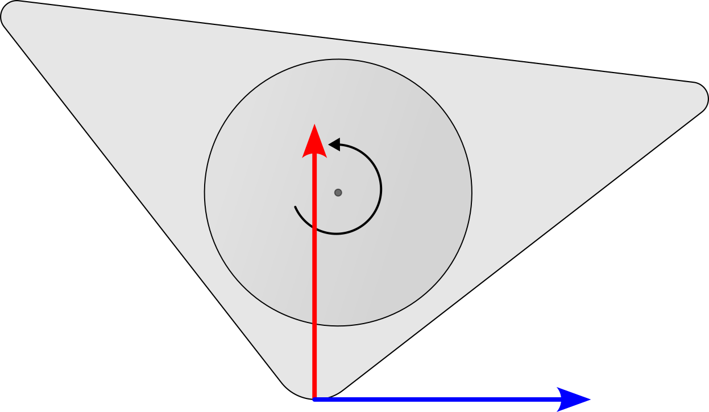

# trical

   

Design and implementation of control systems for a Triangle Balance Robot in the [dc&e](https://github.com/risherlock/dc-e) club. The goal is to first start with conventional full-state feedback control and then experiment with different control approaches, such as RL and MPC, while making the most out of control and estimation theory in the process.

## Progress

   

## Team

1. Himanshu Paudel
